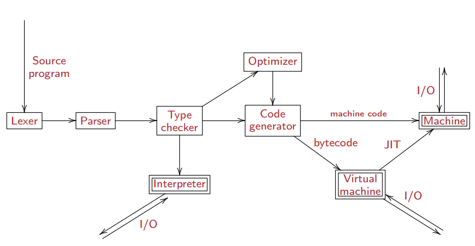
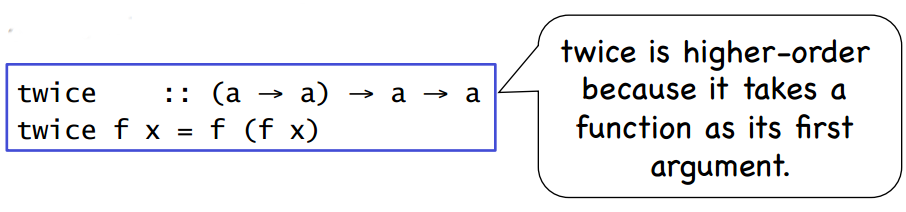

#PROGRAMMING LANGUAGES
##Info
Professor: Dr. Hyunyoung Lee <br>
Office hours: see website <br>
Location: HRBB 124 <br>
Section 500<br>
Final Date: Wednesday, December 17th 8:00 a.m.<br>

----
#Final Review
"The final exam is comprehensive. Approximately 50% of the problems will be related to the topics up to the midterm exam. Study the **lecture slides, example codes, in-class exercises, and quizzes!**." The topics covered will be grouped into three parts:<br>
##Programming language design and implementation
###Overview
**Different approaches to describe computations**
* Imperative - Algorithms implemented in explicit steps
 * C++, Java
* Declarative - Build structures without describing control flow (more abstract than imperative)
 * SQL
* Functional - Treats computation as the evaluation of mathematical functions
 * Lisp, Scheme, Haskell
<br>

**Different approaches to communicate ideas**
* Procedural 
 * (ALGOL, Pascal, C)
* Object oriented 
 * (Smarttalk, Java, C++)
* Domain specific languages 
 * (HTML, Verilog, MATLAB)...
* Programming languages need to have a specification: the semantics of all programs of the language should be unambiguously specified<br>
<br>

**Programming language expressiveness - Different levels of abstraction**
* Haskel, Prolog
* Scheme, Java
* C
* Assembly
* Machine language
<br>

**Defining a Programming Language**
* Languages have both syntax and semantic constraints
 * Syntax defines the literal way in which code is written, semantics define what the code actually does.
* Syntax: Defines the set of **valid** programs
 * Usually defined with the help of grammars and other conditions
* Semantics: Defines the **meaning** of programs
 * Defined e.g., as the effect of individual language constructs to the values of program variables
  <br>
  
**Implementing a Programming Language**
* The goal is to undo abstraction
 * Source -> assembly -> machine language<br>

----
###Required Knowledge
###Implementing a Programming Language
"Implementing a programming language -- each step, how each step is called, and in what order"<br>

* Lexer
 * Lexical analysis is the process of converting a sequence of characters into a sequence of tokens, i.e. meaningful character strings. 
* Parser
 * Parsing or syntactic analysis is the process of analysing a string of symbols, either in natural language or in computer languages, conforming to the rules of a formal grammar.
* Type Checker
 * The process of verifying and enforcing the constraints of types – type checking – may occur either at compile-time (a static check) or run-time (a dynamic check). 
* Interpreter
 * An interpreter is a computer program that directly executes, i.e. performs, instructions written in a programming or scripting language, without previously compiling them into a machine language program.
* Optimizer
 * The process of modifying a software system to make some aspect of it work more efficiently or use fewer resources. 
* Code Generator
 *  The process by which a compiler's code generator converts some intermediate representation of source code into a form (e.g., machine code) that can be readily executed by a machine.
* Virtual Machine
 * A process virtual machine (also, language virtual machine) is designed to run a single program, which means that it supports a single process. Such virtual machines are usually closely suited to one or more programming languages and built with the purpose of providing program portability and flexibility (amongst other things). An essential characteristic of a virtual machine is that the software running inside is limited to the resources and abstractions provided by the virtual machine—it cannot break out of its virtual environment.
* Computer Architecture
 *  A set of disciplines that describes a computer system by specifying its parts and their relations. For example, at a high level, computer architecture may be concerned with how the central processing unit (CPU) acts and how it uses computer memory.
<br>


##Haskell
###Haskell is a lazy pure functional language
"What does this mean?"<br>
* Lazy evaluation
 *  An evaluation strategy which delays the evaluation of an expression until its value is needed (non-strict evaluation) and which also avoids repeated evaluations (sharing). The sharing can reduce the running time of certain functions by an exponential factor over other non-strict evaluation strategies, such as call-by-name.
* Functional programming
 * A programming paradigm, a style of building the structure and elements of computer programs, that treats computation as the evaluation of mathematical functions and avoids changing-state and mutable data.
 * It is a declarative programming paradigm, which means programming is done with expressions.
* Purely functional
 * Algorithms, data structures, or programming languages are called purely functional if they guarantee the (weak) equivalence of call-by-name, call-by-value and call-by-need evaluation strategies, often by excluding destructive modifications (updates) of entities in the program's running environment. According to this restriction, variables are used in a mathematical sense, with identifiers referring to immutable, persistent values.
<br>

###Given a function definition with more than one argument, know how the curried version can be understood in terms of lambda expressions.
**Currying** is the technique of translating the evaluation of a function that takes multiple arguments (or a tuple of arguments) into evaluating a sequence of functions, each with a single argument.
* Higher-order Functions
  * A function is called higher-order if it takes a function as an argument or returns a function as a result. 
* Useful because...
 * Common programming idioms can be encoded as functions within the language itself.
 * Domain specific languages can be defined as collections of higher-order functions. For example, higher-order functions for processing lists.
 * Algebraic properties of higher-order functions can be used to reason about programs.<br>
**Example**: Map function<br>

```
map :: (a → b) → [a] → [b]
```

The map function can be defined in a particularly simple manner using a list comprehension:<br>

```
map f xs = [f x | x ← xs] 
```

Alternatively, it can also be defined using recursion:<br>

```
map f [] = [] 
map f (x:xs) = f x : map f xs 
```

**Example**: Foldr function<br>
* A number of functions on lists can be defined using the following simple pattern of recursion:

```
f [] = v
f (x:xs) = x ⊕ f xs
```

* f maps the empty list to some value v, and any non-empty list to some function ⊕ applied to its head and f of its tail.
The higher-order library function foldr (fold right) encapsulates this simple pattern of recursion, with the function ⊕ and the value v as arguments. For example:<br>

```
sum = foldr (+) 0
product = foldr (*) 1
or = foldr (||) False
and = foldr (&&) True 
```

**Review from the quiz:**

```
foldl :: (a -> b -> a) -> a -> [b] -> a
foldr :: (a -> b -> b) -> b -> [a] -> b
filter :: (a -> Bool) -> [a] -> [a]
all :: (a -> Bool) -> [a] -> Bool
map :: (a -> b) -> [a] -> [b]
(.) :: (b -> c) -> (a -> b) -> (a -> c)
```

**Lambda Expressions** or an anonymous function is a function without a name. It is a Lambda abstraction and might look like this: `\x -> x + 1h`<br>
* **Example:** (todo)<br>

###Evaluation of Haskell expressions
**Example 1**<br>

```
words
```

**Example 2**<br>

```
words
```

###Types of Haskell expressions
From the quiz - evaluate the type of each of the following expression.<br>

**Example 1**<br>

```
[’a’,’b’,’c’]
Solution. [ Char ]
```

**Example 2**<br>

```
(’a’,’b’,’c’)
Solution. ( Char, Char, Char )
```

**Example 3**<br>

```
[ (False,’0’) , (True,’1’) ]
Solution. [ ( Bool, Char ) ]
```

**Example 4**<br>

```
( [False,True] , [’0’,’1’] )
Solution. ( [ Bool ], [Char] )
```

**Example 5 \* **<br>

```
[tail , init, reverse]
Solution. [ [a] -> [a] ]
```

From the quiz -  What is the type of each of the following functions?

**Example 6**<br>

```
pair x y = (x,y)
Solution. pair :: t -> t1 -> (t, t1)
```

**Example 7**<br>

```
Solution. multTen :: Num a => a -> a (Num type class is needed for *.)
```

**Example 8**<br>

```
Solution. palindrome :: Eq a => [a] -> Bool (Eq type class is needed for ==.)
```

**Example 9**<br>

```
isGreaterThanHalf x y = x * 2 > y
Solution. isGreaterThanHalf :: (Num a, Ord a) => a -> a -> Bool
(Num type class is needed for * and Ord for >.)
```

**Example 10**<br>

```
f ( : ( , x): ) = x
Solution. f :: [(t, t1)] -> t1 (See Quiz 1 Solutions for explanation.)
```


##Java
words go here.

###References
[1] Wikipedia.org
